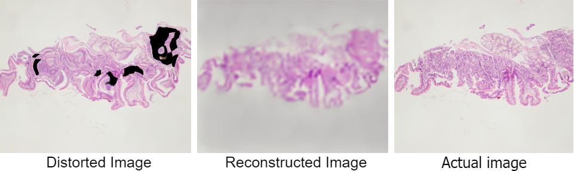

# SuPix
A self-supervised representation learning model for biopsy images of the human duodenum using super-pixel inpainting. In this method, we design a novel composite pretext task for targeted inpainting and elastic deformations. A fully supervised model is initially trained on a small number of labeled data. This model is used to generate psuedo-labels for important anatomical regions in unlabeled biopsy images. Some of these regions are randomly masked and the entire image is deformed using elastic deformation as mentioned in [this paper.](http://cognitivemedium.com/assets/rmnist/Simard.pdf) An encoder-decoder pair is trained to reconstruct the masked, deformed image using the SSIM loss. The model thus learns representation for shapes and H&E color stain distributions of different important tissues like Epithelium, Crypts and Villi. This model is then fine-tuned on a small labeled subset of images for semantic segmentation.

Visualization of representation learning:

